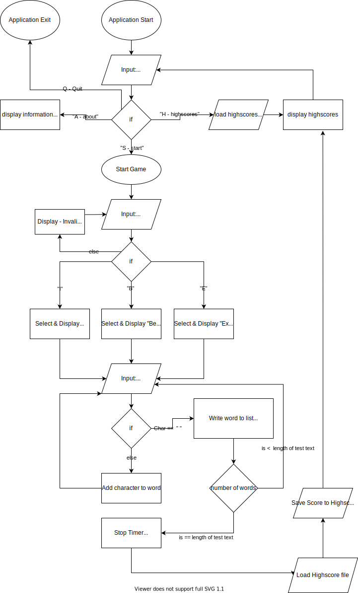

# Assignment 3: Python Terminal Application

## Software Development Plan

### Author: Lachlan Greve - CCC012117

## Statement of Purpose and Scope

*Tpye* is a terminal based typing game written in the Python programing language. The ability to type quickly and accurately is a core skill of being able to use a computer effectively. This program provides a tool for users to improve their typing skills in a fun and engaging way. The application has been designed to accommodate users of all skills and backgrounds through a variable difficulty setting.  

Before starting the application please ensure that all of the system environment requirements have been met. Navigate to your *type* installation folder and execute the following command in your command line prompt: 
`-pip3 install -r path/to/your/requirements.txt`

To start the application enter: `tpye.sh` at your command line prompt.

The user will then interact with the application through text based prompts. 

When starting the application, the user will be asked to input their name and difficulty. They will then be presented with a passage of text to type. Upon completion a score will be calculated and displayed to the user. 

`usage: tpye.sh [--COMMAND]`  
`optional arguments: `  
`--help : show this message and exit`  
`--start : immediately start application, skipping menus`  
`--about : display a brief description of the application`  
`--highscores : display previous players highscores`  
`--version : print the current version of the application and exit`  

## Features

### Variable Difficulty

The user can select a difficulty setting at the start of the application. The application will have three different difficulty settings (beginner, intermediate and expert). The difficulty variable will select a passage of text for the user to type from a nested dictionary stored within the application. Harder difficulties will require the user to type longer and more gramatically intensive passages of text.

All typing tests used in this program have been sourced from https://thepracticetest.com/typing/tests/practice-paragraphs/ and its Authors. I take no credit for developing this material.

### Text Highlighting
  
As the user types the required passage of text, the characters input will be captured and stored in a variable. Once a word has been completed the word will be saved to a list of words typed by the user.

The display will dynamically highlight the current word that the user is attempting to type in the color blue and will highlight previously typed words in either green or red depending on if it was typed correctly.

### Score Calculation

Once the user has completed the passage of text the application will calculate a score based on the amount of the time user took to complete the test and the number of words they spelt correctly.

The top 10 scores for each difficulty will be stored on persistent file that will be saved between executions of the application. Each score will be identified by a input name provided to the application.  

## User Interaction and Experience

The user will navigate and interact with the program through text based prompts and input.

Upon launching the application the user is prompted for a selection:

- About : prompting text explaining about the features, how to use and the purpose of the application.
- Start : Starting the main typing game
- High Scores : View top 10 previous high scores for each difficulty setting.

After starting the game the user will be asked to select a difficulty setting and enter their name. They will then be prompted to type a passage of text as quickly as they can. As words are typed the text will be dynamically highlighted to visually communicate progress to the user.

After completing the passage of text the users score will be calculated and displayed to them. They will then be prompted with a choice to play again or quit the application.  

## Control flow diagram

